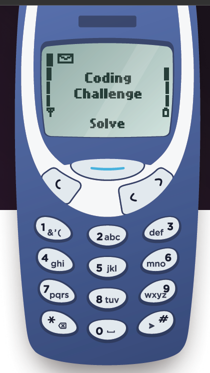

# 📱 Old Phone Control Challenge

Simulate typing text on a **classic Nokia keypad** and decode it into readable text.  
Each key press represents letters (like old SMS typing), and special symbols `*` and `#` perform actions like **delete** and **end**.

---

## 🧩 Description

This challenge decodes sequences of numbers into their corresponding letters based on the **multi-tap phone input system**.

<table>
<tr>
<td>

| Key | Characters |
|-----|-------------|
| 1 | & ' ( |
| 2 | A B C |
| 3 | D E F |
| 4 | G H I |
| 5 | J K L |
| 6 | M N O |
| 7 | P Q R S |
| 8 | T U V |
| 9 | W X Y Z |
| 0 | Space |
| * | Backspace |
| # | End of Input |

</td>
<td>
  
</td>
</tr>
</table>

---